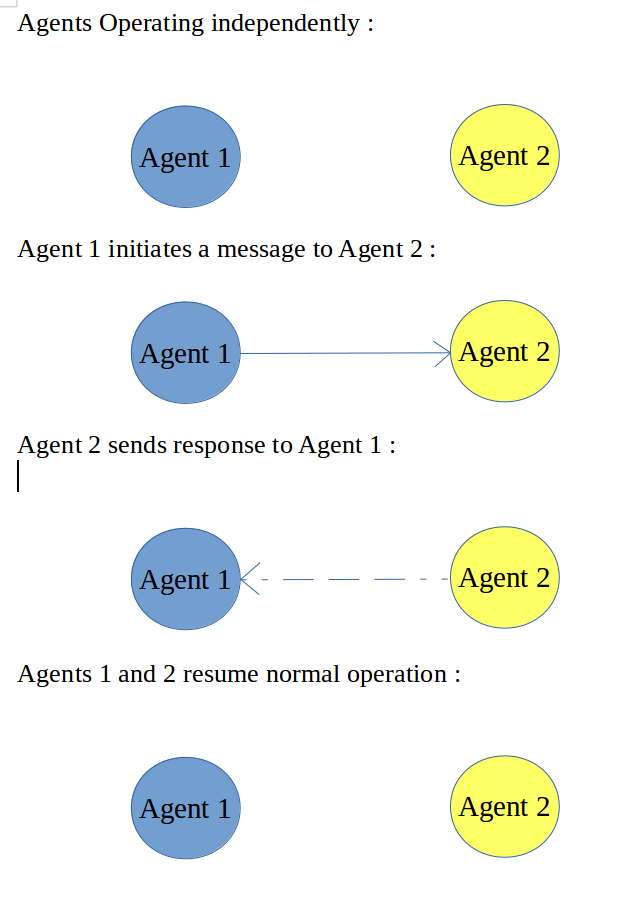

## Visualization Proposal

### Motivation :
* The Bakery eco-system which we have designed is quite complex (consisting of number of agents interacting with each other).
* For this kind of system, use of just console traces is not suitable for understanding the interactions between the agents. Also debugging the issues in this complex system using just traces becomes a nightmare.
* Hence the use of visual aids for representing the interactions between the various agents in the system is very essential.

### Approaches :
* Following are the proposals for the visualization agent for the Bakery eco-system.
    * **Approach 1:** 
        * Sniffer is a tool provide by tilab for tracking messages being communicated between different agents in a Jade Environment. 
        * For more details refer the following link ([tilab](http://jade.tilab.com/documentation/tutorials-guides/sniffer/introduction/))

    * **Approach 2:** 
        * All Agents are represented using Rectangles.
        * When ever an Agent is spawned, a new Rectangle is added to the canvas/window/console.
        * The color of the rectangle represents the state the agent is in.
        * Consider the following scenarion as an example. The Agent can be in either of the following 4 states,
            * **Operating :** The color of the agent is yellow in this state.
                * When Agent is initiated, it is in this state.
            * **Processing New Message :** The color of the agent is blue in this state.
                * When Agent is processing a newly received message, it is in this state.
            * **Waiting :** The color of the agent is red in this state.
                * When the Agent is waiting on a message from another Agent, it is in this state.
            * **Sending Message :** The color of the agent is green in this state.
                * When the Agent is composing a message to sent to another agent, it is in this state.
        * Consider the following simplified scenario to illustrate this approach.

        

    * **Approach 3:**
        * All Agents are represented using Circles.
        * When ever an Agent is spawned, a new circle is added to the canvas/window/console.
        * The color of the Circle represents the stage to which it belongs.
        * The message communication between Agents can be modeled using arrows.
        * Variety of different arrows can be used to represent different types of messages being shared between agents. For Example, A bold and continuous arrow can represent a Request message and a dotted line arrow can be used to represent the response of that message.
        * Consider the following simplified scenario to illustrate this approach.

        

    
    * **Approach 4:**
        * Similar to Approach 1. The difference lies in the fact that we represent messages as smaller rectanges.
        * The message rectangles move from sender agent to receiver agent.

    * **Approach 5:**
        * Similar to Approach 2. The difference lies in the fact that we represent messages as smaller rectanges.
        * The message rectangles move from sender agent to receiver agent.
    * **Approach 6:**
        * Each stage is represented by columns. Similar to github project boards, the orders can be moved from one column to another. 
        * The agents cannot be visualised here, neither can the messages be tracked. But it gives a overall progress of how much a particular orders has been processed. More useful for customers.

* Approach-1 would suffice our requirement quite well and is readily available.

### Visualization Frameworks :

* Depending on the material on which we render our visualization we divided this section into two types.

* ** Visualization options with X Window options :**

    * If the machine on which testing is being done supports X Windows, we can use available Java frameworks for rendering the agents and the interactions taking place between them.

    * Some widely used X Windows based frameworks like Swing together with Abstract Window Toolkit (AWT) can be used to generate simple animations on the X Windows.

    * Sniffer tool from tilab ([tilab](http://jade.tilab.com/documentation/tutorials-guides/sniffer/introduction/))

* ** Visualization options using console : **

    * If the machine on which testing is being done does not support X Windows, (maybe like travis on which automated testing is being done), then there are not many options readily available on Java.

    * There are frameworks for converting images to ascii art to be displayed on the console but that is not what we need.

    * There are frameworks/codebases for ascii 2d console games. However tweaking them for our use case is a huge project in itself. ([roguebasin](http://roguebasin.roguelikedevelopment.org/index.php?title=Main_Page#Java_Roguelike_Development_Guide))

    * One approach might be to implement a simple stdout print based approach for displaying the predefined shapes on the console.

### Visualization Agent Implementation :

* Irrespective of the material on which the visualization is presented, the approach used for coveying the information from the Bakery agents to the Visualization agent is illustrated below.
    * All the Agents in the bakery will update their status to a file (file format can be defined later).
    * The format of data which is written by Agents to the file can be defined and confirmed with the developers of different Agents.
    * The Visualization Agent will periodically parse this file and if it sees any change in the contents, it updates its own view of the system and then renders its own view on the canvas(X window or console).
    * At the end of the simulation, the Visualization agent is also terminated.
